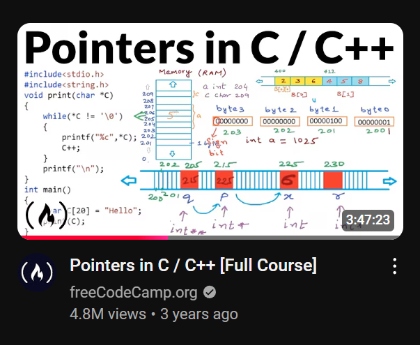

# C++ Pointers Repository

Welcome to my C++ Pointers Repository! This repository is dedicated to documenting my journey in mastering pointers in C++. Here, you will find:

- **Code Examples**: Demonstrations of pointer concepts.
- **Practice Questions**: Problems to strengthen your understanding.
- **Notes**: Explanations and summaries of important topics.

## Repository Structure

The repository is organized into the following directories:

1. **Code**: 
   - Contains C++ programs showcasing various pointer-related concepts.
   - Examples include:
     - Pointer basics
     - Pointer arithmetic
     - Dynamic memory allocation
     - Pointers to arrays, functions, and objects

2. **Practice**: 
   - A collection of pointer-based problems with solutions.
   - Designed to test and enhance your understanding.

3. **Notes**: 
   - Contains detailed explanations of pointer topics.
   - Covers theory, use cases, and best practices.

## Getting Started

### Prerequisites
To run the code in this repository, you need:

- A C++ compiler (e.g., GCC, Clang, or MSVC).
- Basic knowledge of C++ syntax.

### Clone the Repository
```bash
# Clone this repository using Git
$ git clone https://github.com/wasif-h/Point-to-Pointers.git

# Navigate to the project directory
$ cd Point-to-Pointers
```

### Running the Code

1. Navigate to the `Code` directory.
2. Compile the desired C++ file using your preferred compiler. For example:
   ```bash
   g++ pointer_basics.cpp -o pointer_basics
   ```
3. Run the compiled program:
   ```bash
   ./pointer_basics
   ```

## Contributing

Contributions are welcome! If you want to add code, questions, or notes, feel free to:

1. Fork this repository.
2. Create a new branch.
3. Make your changes.
4. Submit a pull request.

## Youtube Recommendations
[FreeCodeCamp](https://youtu.be/zuegQmMdy8M?si=s809M9CD0kd5yEoQ)



---

Happy coding! 🎉
